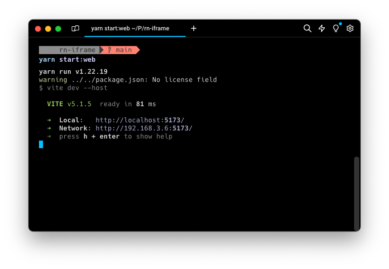
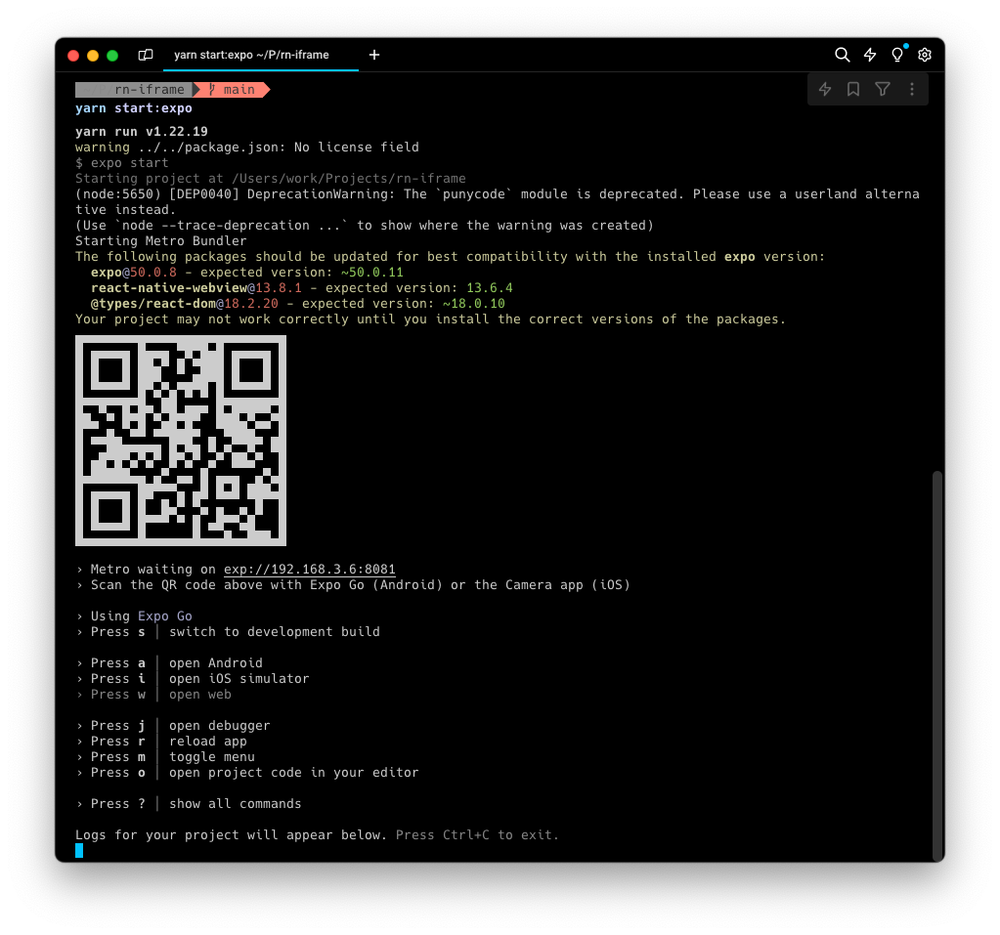

# RN Iframe example

## Description

The `@unionavatars/iframe` project only works with web technologies (at least at the time of the writing). So for this to work we are using a web view that embeds a web applications that includes the iframe which the web application will interact.

Host the web application and include it in the webview source to try it.

## Try it

run `yarn start:web` this will print a screen like this one

Replace the variable `webAppUri` inside the file `App.tsx` and set the "Network" ip address, being `http://192.168.3.6:5173` the one in the example

And now start the react native expo application with `yarn start:expo`

Use the QR Code to start developing the React Native application